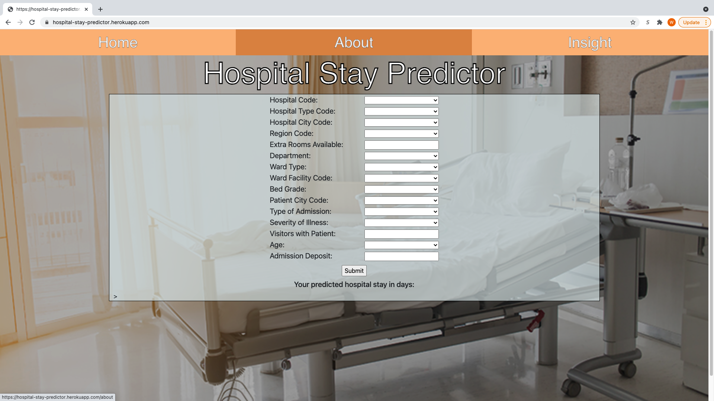

## Final Project - Demystifying ML
### Team1-Hospital-Stay-Predictor
#### Project Overview
#### An end-to-end machine learning project that projects the length of stay (LOS) for a hospital patient.
This prediction model was made using a dataset found on kaggle.com, originally from an Analytics Vidhya Hackathon on Healthcare Analytics. After cleaning the data in Google Colaboratory, building the model with Tensorflow, and fitting the model with the data, it was able to predict the length of a hospital stay with about 42% accuracy. The main limitations were the size of the data set as well as little to no documentation on the meaning of the values.  Nevertheless, if a user hypothetically had access to all of the information required, they could use this model to make a prediction. This could be useful for a patient's own knowledge and efficiency in selecting a hospital, or for hospital staff to keep track of and make decisions for their patients.
#### Design & Technical Overview
#### - Backend development, machine learning mdoel: neural network, keras
#### - Web framework/workflow engine: Flask
#### - Frontend development: HTML/CSS, Tableau

#### - Link to Site: https://hospital-stay-predictor.herokuapp.com/

  
##### Made by Will Cutrone, Stephen Domke, Mona Peteet and Tom Babjack   
##### May 2021
